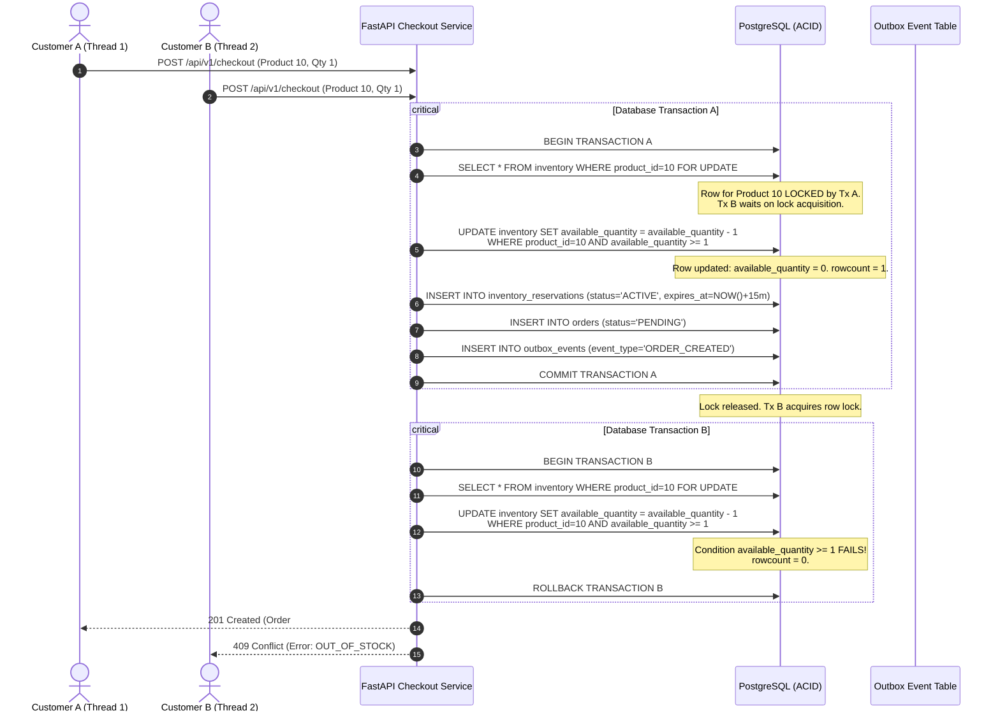
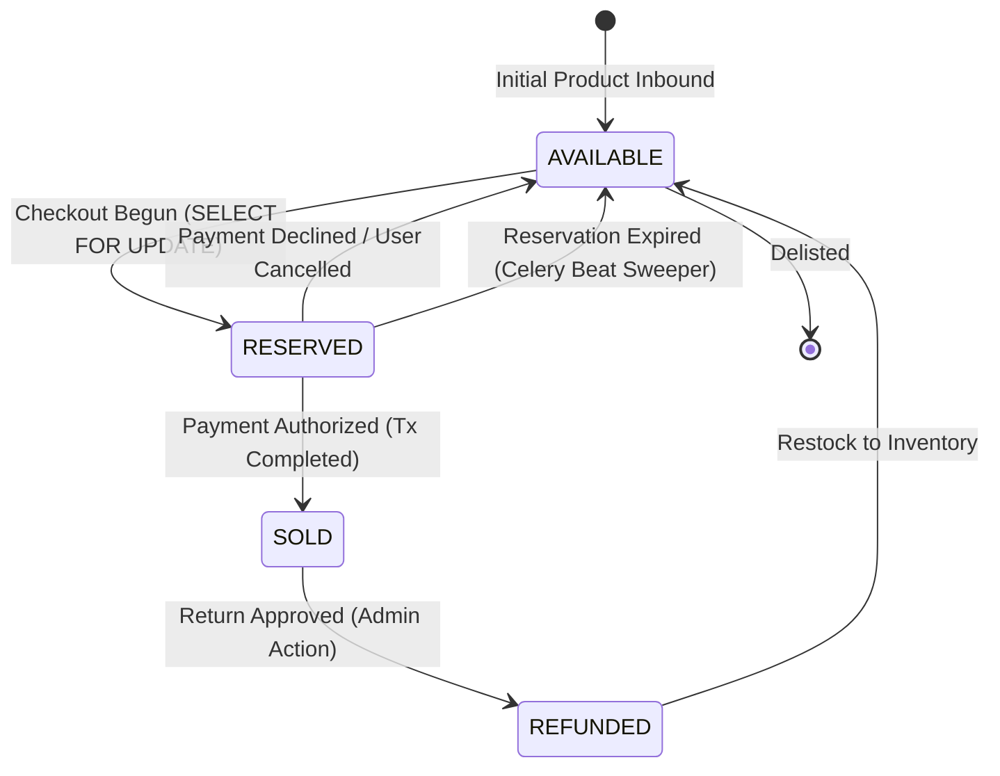
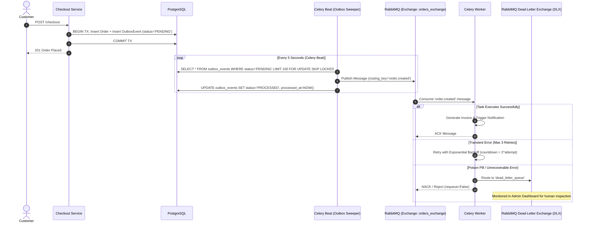
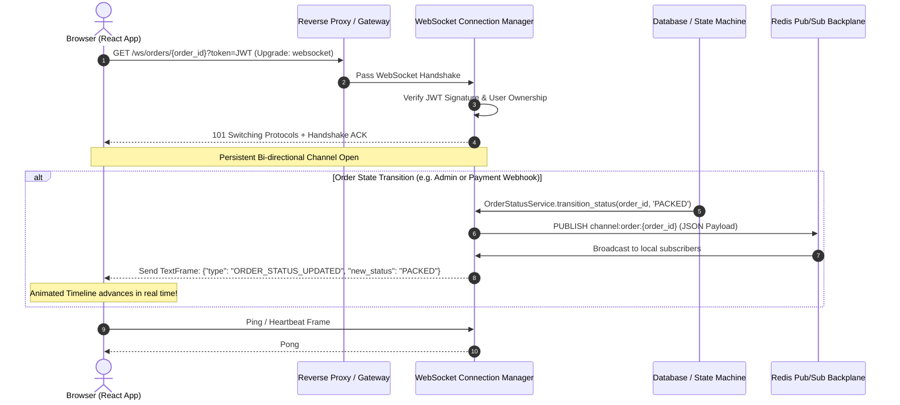

# ShopFlow Distributed Architecture & Sequence Flows

This document details the architectural mechanisms, state machines, and sequence flows powering **ShopFlow**.

---

## 1. Concurrency Control & Row-Level Locking Sequence

When multiple users race to purchase the final available stock of a product ($stock = 1$), ShopFlow uses pessimistic row-level locking with atomic conditional updates to guarantee zero overselling.

---

## 2. Inventory Reservation State Machine

---

## 3. Transactional Outbox Pattern & Async RabbitMQ / Celery Pipeline

To solve the dual-write problem (writing to a database while simultaneously publishing to a message broker), events are persisted directly into PostgreSQL within the same atomic ACID transaction as the order.

---

## 4. Real-Time WebSockets Order Streaming Sequence

---

## 5. Redis Sliding-Window Rate Limiting (Sorted Sets)

ShopFlow uses Redis sorted sets (`ZSET`) where score is timestamp in milliseconds:

1. Remove expired timestamps outside the rolling window:
   `ZREMRANGEBYSCORE key 0 (current_timestamp - window_ms)`
2. Count remaining timestamps inside the window:
   `ZCARD key`
3. If count $\ge$ allowed limit, reject with `429 Too Many Requests`.
4. Otherwise, record the request:
   `ZADD key current_timestamp unique_request_id`
   `EXPIRE key window_seconds`
